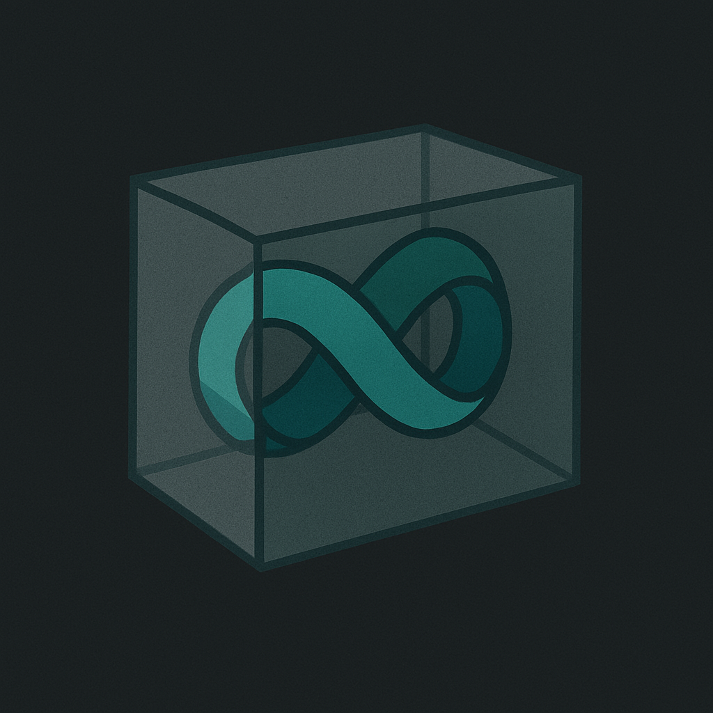

</img>

# mobius-concrete
*Modular and cementable software blocks for graphical user interfaces*

<!--  -->

A reactive UI framework layer built on top of Masonry. 

- Composable and modular construction of applications
- Reactive widgets with internal and external state via `Dynamic<T>`
- Slots with self-threading `Slot<T>` for compute intensive applications

The general focus of mobius-concrete will be to provide a layer two solution 
for `Masonry` with a user facing API that supports modular designs emphasizing
reactive composable widgets with optional runtimes.   

Currently using `egui_mobius` elements, and this will be migrated locally into
this repository. Reactive+async and threaded-slot elements will be included. 

## Background

This repo is also the result of asking the question "What Rust frameworks make the best
use of Traits?" 

Rust’s strength is supposed to be in composability, safety, and trait-based polymorphism, and yet many GUI frameworks end up with chaotic, inflexible, or boilerplate-heavy APIs. Masonry is built with Traits 
in mind in all aspects of its design, so developing a layer two solution
on top of Masonry with these features is appealing. 

## Strengths of Masonry

The framework is structured around a trait-based retained-tree architecture.

Each Widget is a trait impl. Layout, paint, access — all trait split.

It's minimal, layered, and very `Rust` oriented.

Why it’s promising:

- Super trait-clean API.

- Allows building up new reactive layers (like mobius-concrete) in idiomatic Rust style.

You feel like you’re building a GUI the way you’d build a CLI parser: in composable units.

At present, it appears as the most trait-centric design from the ground up. Still *niche*, but extremely promising for serious use and composing larger
scale designs in a modular fashion. 

### Goals

The primary goal of this repository is to
- Make a series of composable reactive widgets for use with Masonry 
- Construct multiple example template style projects,
- Develop an ergonomic API that is geared towards a combined paradigm of 
functional-reactive+async with thread allocation (slots) when needed, similar to what
was employed with `egui_mobius`. 

The last point above is one reason why the author is going this route versus
using `xilem` for example. 

### License and Contributions

This repos is under the `MIT` License. Pull requests are welcome that are aligned
with the general goals stated above. Thanks.  